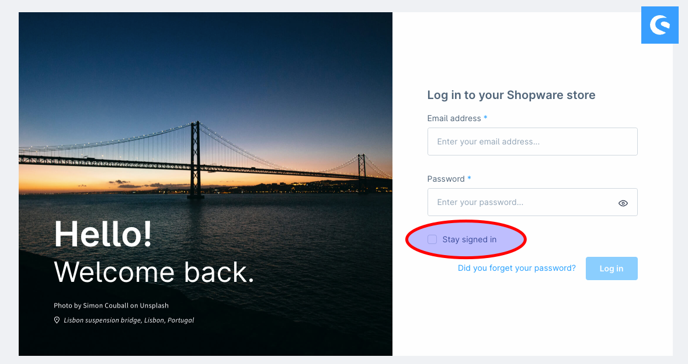

---
nav:
  title: v6.6.0.0
meta:
  date: "2024-03-18"
---

# Release notes Shopware 6.6.0.0

## Abstract

Shopware 6.6.0.0 is a major release containing breaking changes.
Please read this document and the linked resources carefully. The system requirements have changed, and third-party dependencies have been updated, as explained below.

This release was built with the help of the community. Thank you for supporting us during the twelve-week RC phase by providing feedback and testing the release under production-like conditions, and thank you for 34 code contributors with 64 merged pull requests in this release.

With this release, we are also officially introducing a new release policy that provides up to two years of support for major versions, starting with Shopware 6.5. A detailed explanation can be found in our blog: [Shopware's new Release Policy](https://www.shopware.com/en/news/shopwares-new-release-policy/)

The Shopware 6.6.0.0 release is focused on core changes instead of features. It provides a foundation for adding new features throughout future minor releases.

## System requirements

* tested on PHP 8.2 and 8.3
* tested on MySQL 8 and MariaDB 10.11

See below for more information on the current minimum versions.

## Improvements

### Removal of deprecations

All code marked as deprecated for 6.6 was removed. This potentially breaks extensions and other customizations. Please see the  [UPGRADE.md](https://github.com/shopware/shopware/blob/trunk/UPGRADE-6.6.md) for detailed information on what has changed.

### Removal of feature flags

Some specific features have already been released and marked with a feature flag. These features are now active by default, introducing breaking changes and requiring code updates:

* New media path behaviour
* Stock Handling
* Change ElasticSearch mapping data to support multi-languages in one index
* Vuejs 3
* Asynchronous theme compilation via message queue
* Async JS plugin loading
* Caching layer improvements

See [details on Github](https://github.com/search?q=repo%3Ashopware%2Fshopware++Feature%3A%3AisActive('v6.6.0.0')&type=code)

### Removal of experimental state

The experimental annotation has been removed from features.

* AsyncThemeCompilation
* QuoteManagement
* Async JS plugin loading

These and a few more features are now stable and can be used in production.

### Vue.js update

[Vue.js 2 is no longer supported](https://endoflife.date/vue) since the end of 2023. We updated the administration component to the latest version of Vue.js, ensuring our customers receive up-to-date and compliant software. A tutorial on how to adapt your plugin-system-based extension to Vue.js 3 is available in the [documentation](https://developer.shopware.com/docs/resources/references/upgrades/administration/vue3.html).

### Webpack update

We updated [Webpack](https://webpack.js.org/) to version 5. The new version and switching from Babel zu [SWC](https://swc.rs/) makes building the administration three times faster. Plugin-system-based extensions with a custom webpack configuration must be migrated to the webpack 5 API.

### Node 20 as the minimum version

As [discussed](https://github.com/shopware/shopware/discussions/3359), the minimum version requirement for Node was changed from 18 to 20. Version 20 is the current LTS version with active support until the end of 2024 and maintenance support until mid-2026.

### Configurable auto logout

The administration login form now has the option to stay signed in, keeping the user logged in for 14 days instead of the previous 30 minutes.

### Symfony upgrade

Shopware 6.6.0.0 upgraded Symfony to the current stable major version 7, as previously announced on [GitHub discussions](https://github.com/shopware/shopware/discussions/3354). More about breaking changes in this Symfony upgrade can be found in [Symfony's upgrade guide](https://github.com/symfony/symfony/blob/7.0/UPGRADE-7.0.md).

### PHP 8.2 as the minimum requirement

With the upgrade to Symfony 7, PHP 8.2 will become the new minimum required version. Refer to the [release information by Symfony](https://symfony.com/releases/7.0) and **check compatibility with your hosting provider**.

### Maria DB 10.11 minimum requirement

The minimum version requirement for Maria DB now is the latest LTS version, v10.11. This version supports the `JSON_OVERLAPS` function, which the "delete unused media" feature needs. MySQL was previously changed to a minimum version of 8.0.

### Redis 7.0 minimum requirement

The minimum version requirement for Redis now is v7.0. It comes with performance improvements and allows using the new [redis function feature](https://redis.io/docs/interact/programmability/functions-intro/).

### Upgrading third-party composer dependencies

We upgraded some third-party composer dependencies, such as `lcobucci/jwt` to v5 or higher and `async-aws/simple-s3` to v2 or higher.

### Stock API changes

We simplified the way Shopware stores stock data and made the system more extendable for developers. It became easier to supplement the stock information with user-defined data and to send it to third-party systems. It is also possible to turn off Shopware's stock management altogether. The new Stock API was introduced in Shopware 6.5.5 behind the `STOCK_HANDLING` feature flag; it is now the default method in Shopware 6.6.

To keep the impact as low as possible, we kept the backwards compatibility for reading the stock. Please note that the feature *multi-inventory* has yet to be compatible. Find more details in the [discussions](https://github.com/shopware/shopware/discussions/3172), the [changelog](https://github.com/shopware/shopware/blob/trunk/changelog/release-6-5-5-0/2023-06-21-stock-refactoring.md), and in our [docs for extending the API](https://developer.shopware.com/docs/guides/plugins/plugins/content/stock/).

### Persistent media path storage

The path to media is now stored in the database instead of being generated on the fly. Please read more about this topic in [discussions](https://github.com/shopware/shopware/discussions/3174).

### Improving the caching layer

Improvements on the caching layer were previously available behind a feature flag. They are now active and available by default. Read [discussion #3299](https://github.com/shopware/shopware/discussions/3299) and [discussion #3171](https://github.com/shopware/shopware/discussions/3171) for more information.

### Availability of symfony/scheduler

Symfony recently added a scheduler component, and we want to use as many official Symfony components as possible. Starting with Shopware 6.6, the Symfony scheduler can be used to execute scheduled tasks instead of the custom Shopware scheduler. For details on how to set it up, take a look at the [documentation](https://developer.shopware.com/docs/v6.6rc/guides/hosting/infrastructure/scheduled-task.html#using-the-symfony-scheduler-to-run-tasks).

### Multilingual ElasticSearch index

The ElasticSearch index is no longer split by language. Translated fields are mapped as object fields. This change in indexing brings performance improvements. Please be aware of this when providing custom properties in ElasticSearch. For more details, please read our [architecture decision record](https://github.com/shopware/shopware/blob/trunk/adr/2023-04-11-new-language-inheritance-mechanism-for-opensearch.md).

### Async JavaScript loading

By introducing asynchronous JS loading and allowing dynamic imports, we could increase the storefront performance and smoothen the JS handling. Read the [discussions](https://github.com/shopware/shopware/discussions/3310) and the [documentation](https://developer.shopware.com/docs/v6.6rc/guides/plugins/plugins/storefront/add-custom-javascript.html#registering-an-async-plugin) for more details.

### Removal of SCSS code

Custom SCSS code was removed from Shopware if it already existed in Bootstrap. Please read more about this in our [architecture decision record](https://github.com/shopware/shopware/blob/trunk/adr/2023-10-19-bootstrap-css-utils.md).

### Low-priority Queue

Before Shopware 6.6.0.0, workers automatically consumed the low-priority queue. Workers for the low-priority queue now have to be started separately. For more details, take a look at the [upgrade guide](https://github.com/shopware/shopware/blob/v6.6.0.0-rc6/UPGRADE-6.6.md#configure-queue-workers-to-consume-low_priority-queue).

## Fixed bugs

* [NEXT-30575](https://issues.shopware.com/issues/NEXT-30575) | HTML sanitizer on mail template header & footer (42 votes)
* [NEXT-15942](https://issues.shopware.com/issues/NEXT-15942) | [github] Compiled storefront JS with modules can't be executed in prod env (41 votes)
* [NEXT-22217](https://issues.shopware.com/issues/NEXT-22217) | Misleading Replace / Rename function in Contents>Media (33 votes)
* [NEXT-26321](https://issues.shopware.com/issues/NEXT-26321) | payment status isn't fully changed (32 votes)
* [NEXT-28671](https://issues.shopware.com/issues/NEXT-28671) | COMMERCIAL: admin is no longer accessible when Commercial is activated. (30 votes)
* [NEXT-29439](https://issues.shopware.com/issues/NEXT-29439) | In the frontend, the products are displayed twice on several pages with the standard sorting "Topseller" (26 votes)
* [NEXT-30489](https://issues.shopware.com/issues/NEXT-30489) | Sanitize: Making shopware's own snippets unusable (24 votes)
* [NEXT-23962](https://issues.shopware.com/issues/NEXT-23962) | Contact form - page cannot be used without reloading the modal (23 votes)
* [NEXT-32925](https://issues.shopware.com/issues/NEXT-32925) | Support for "Google Consent Mode v2" (18 votes)
* [NEXT-30785](https://issues.shopware.com/issues/NEXT-30785) | Country/region is defined as a mandatory field, but is not requested in the checkout (17 votes)
* [NEXT-30672](https://issues.shopware.com/issues/NEXT-30672) | [Github] Fix for distorted Thumbnails (17 votes)
* [NEXT-17301](https://issues.shopware.com/issues/NEXT-17301) | Error when trying to add properties to variants, if the main product does not have any properties assigned (17 votes)
* [NEXT-34012](https://issues.shopware.com/issues/NEXT-34012) | Wrong URL in product-export Feed for Google Merchant Center (16 votes)
* [NEXT-19420](https://issues.shopware.com/issues/NEXT-19420) | Internal linking to a landingpage doesn't work properly, even with sitemap (16 votes)
* [NEXT-18778](https://issues.shopware.com/issues/NEXT-18778) | Test mails do not contain mail header and footer in correct language (15 votes)
* [NEXT-23783](https://issues.shopware.com/issues/NEXT-23783) | Affiliate Code / Campaign Code Tracking not working when you initiale enter the shop with tracking URL (14 votes)
* [NEXT-22973](https://issues.shopware.com/issues/NEXT-22973) | Snippet renaming leads to vanishing of it | Snippet-Umbenennung führt zum Verschwinden des Snippets (14 votes)
* [NEXT-11827](https://issues.shopware.com/issues/NEXT-11827) | MediaService creates temporary files that are never cleaned up (14 votes)
* [NEXT-33881](https://issues.shopware.com/issues/NEXT-33881) | Cannot request 'user-verified' scope for client_credentials (13 votes)
* [NEXT-24580](https://issues.shopware.com/issues/NEXT-24580) | Versandstatus in Bestellübersicht stimmt nicht mit Versandstatus in Bestell-Detailansicht überein (13 votes)
* [NEXT-24159](https://issues.shopware.com/issues/NEXT-24159) | Problem loading snippets from parent of parent theme (13 votes)
* [NEXT-32276](https://issues.shopware.com/issues/NEXT-32276) | Custom sort in Category listing leads to 404 (12 votes)
* [NEXT-29601](https://issues.shopware.com/issues/NEXT-29601) | Storno PDF wird aus aktuellen Daten generiert. (12 votes)
* [NEXT-32133](https://issues.shopware.com/issues/NEXT-32133) | Order: Can not change order status (11 votes)
* [NEXT-31769](https://issues.shopware.com/issues/NEXT-31769) | ES admin search is broken with third party plugins (8 votes)
* [NEXT-31716](https://issues.shopware.com/issues/NEXT-31716) | Cross selling in combination with Elasticsearch leads to an error in the storefornt (7 votes)
* [NEXT-34060](https://issues.shopware.com/issues/NEXT-34060) | No ips selectable in allowlist at sales channel (6 votes)
* [NEXT-33859](https://issues.shopware.com/issues/NEXT-33859) | JoinGroupBuilder breaks with multiple filters on nested associations (6 votes)
* [NEXT-32768](https://issues.shopware.com/issues/NEXT-32768) | DAL Filter of Admin API produces incorrect results (6 votes)
* [NEXT-31919](https://issues.shopware.com/issues/NEXT-31919) | RequestTransformer determines the wrong url as best match (6 votes)
* [NEXT-28235](https://issues.shopware.com/issues/NEXT-28235) | The ISO code of the standard shop language can be changed | Der ISO Code der Standardshopsprache kann geändert werden (6 votes)
* [NEXT-17592](https://issues.shopware.com/issues/NEXT-17592) | Incorrect contact-form receiver validation-regex (6 votes)
* [NEXT-33846](https://issues.shopware.com/issues/NEXT-33846) | Missing Indexer in setDeletedNewsletterRecipients causes Dead Messeges spam (5 votes)
* [NEXT-33403](https://issues.shopware.com/issues/NEXT-33403) | Debug Messages are being logged in 'elasticsearch_prod log (5 votes)
* [NEXT-33064](https://issues.shopware.com/issues/NEXT-33064) | Ab-Preis bei Variantenartikeln wird nicht angezeigt. ABMAHNGEFAHR!! (5 votes)
* [NEXT-29424](https://issues.shopware.com/issues/NEXT-29424) | Wishlist vs. Line-Items: ReferenceId kann leer sein (5 votes)
* [NEXT-28322](https://issues.shopware.com/issues/NEXT-28322) | Serialization failure while generating product variants (5 votes)
* [NEXT-33867](https://issues.shopware.com/issues/NEXT-33867) | sw-settings-loggin-list calls this.$options.components (4 votes)
* [NEXT-33038](https://issues.shopware.com/issues/NEXT-33038) | Removed payment methods cause problems when loading an order (4 votes)
* [NEXT-33031](https://issues.shopware.com/issues/NEXT-33031) | Problems with displaying the admin panel on a mobile device. (4 votes)
* [NEXT-32266](https://issues.shopware.com/issues/NEXT-32266) | Administration: Not all displayed data is updated when you click on a search result (4 votes)
* [NEXT-31763](https://issues.shopware.com/issues/NEXT-31763) | More or less than three characters (currency -> "short name") creates an error in orders (4 votes)
* [NEXT-31040](https://issues.shopware.com/issues/NEXT-31040) | CustomField Type "Media" - missing pagination in media selection / search results (4 votes)
* [NEXT-30424](https://issues.shopware.com/issues/NEXT-30424) | Broken CMS element "image" (4 votes)
* [NEXT-30314](https://issues.shopware.com/issues/NEXT-30314) | CMS image slider settings broken (4 votes)
* [NEXT-34068](https://issues.shopware.com/issues/NEXT-34068) | The "Send email" action is missing in Flow Builder Delayed Actions (3 votes)
* [NEXT-33724](https://issues.shopware.com/issues/NEXT-33724) | Wrong currency in the order (3 votes)
* [NEXT-33642](https://issues.shopware.com/issues/NEXT-33642) | Product export - CDN URL replaced with saleschannel domain URL for product images (3 votes)
* [NEXT-32742](https://issues.shopware.com/issues/NEXT-32742) | Salutation in contact form is not displayed correctly with inherited languages (3 votes)
* [NEXT-31983](https://issues.shopware.com/issues/NEXT-31983) | if ordered product is deleted, the product links in account order overview are broken (3 votes)
* [NEXT-29628](https://issues.shopware.com/issues/NEXT-29628) | Country not shown in order details (3 votes)
* [NEXT-28694](https://issues.shopware.com/issues/NEXT-28694) | Property characteristics are usually displayed without a property (3 votes)
* [NEXT-28228](https://issues.shopware.com/issues/NEXT-28228) | meta og:url is cached for 404 pages (3 votes)
* [NEXT-33864](https://issues.shopware.com/issues/NEXT-33864) | ControllerRoutes Annotation  Problem (2 votes)
* [NEXT-33360](https://issues.shopware.com/issues/NEXT-33360) | Save discount for set groups not possible / (2 votes)
* [NEXT-32093](https://issues.shopware.com/issues/NEXT-32093) | Product variants are deactivated during export and import. (2 votes)
* [NEXT-31979](https://issues.shopware.com/issues/NEXT-31979) | Birthdate is mandatory in customer account (2 votes)
* [NEXT-25102](https://issues.shopware.com/issues/NEXT-25102) | Multiple CMS elements registered via Shopware 6 Admin SDK share same element config data (2 votes)
* [NEXT-34102](https://issues.shopware.com/issues/NEXT-34102) | [Github] NEXT-00000 - Add new block in analytics template (1 votes)
* [NEXT-33455](https://issues.shopware.com/issues/NEXT-33455) | Plugin index.html don't work with cloud asset versioning (1 votes)
* [NEXT-33063](https://issues.shopware.com/issues/NEXT-33063) | SwagCommercial: dal:create:schema fails for entities with CronIntervalField or DateIntervalField (1 votes)
* [NEXT-32814](https://issues.shopware.com/issues/NEXT-32814) | Admin Elasticsearch Indexer: Search for order with multiple documents by document number does not work (1 votes)
* [NEXT-32745](https://issues.shopware.com/issues/NEXT-32745) | Admin Extension SDK causes browser to freeze with custom products (1 votes)
* [NEXT-32738](https://issues.shopware.com/issues/NEXT-32738) | Order Line Item edit not possible for deleted products (1 votes)
* [NEXT-32269](https://issues.shopware.com/issues/NEXT-32269) | [Github] fix: Make sure that the Storefront scripts are only included once (1 votes)
* [NEXT-32091](https://issues.shopware.com/issues/NEXT-32091) | CMS elements based on Admin SDK are missing essential query params for remote server authentication (1 votes)
* [NEXT-32024](https://issues.shopware.com/issues/NEXT-32024) | Language resets to default language for customer after login (1 votes)
* [NEXT-31986](https://issues.shopware.com/issues/NEXT-31986) | Store API search returns to many products with advanced search enabled (1 votes)
* [NEXT-31770](https://issues.shopware.com/issues/NEXT-31770) | Product comparison Scheduled Export Image URLs APP_URL used instead of assigned SalesChannel URL (1 votes)
* [NEXT-30089](https://issues.shopware.com/issues/NEXT-30089) | TreeBuildingNavigationRoute has the wrong entity (1 votes)
* [NEXT-34329](https://issues.shopware.com/issues/NEXT-34329) | CMS categories in the blocks dropdown are suddenly duplicated (0 votes)
* [NEXT-34215](https://issues.shopware.com/issues/NEXT-34215) | Fix field inheritance (0 votes)
* [NEXT-34213](https://issues.shopware.com/issues/NEXT-34213) | Error thrown, when returning from Order Detail page to Order List (0 votes)
* [NEXT-34165](https://issues.shopware.com/issues/NEXT-34165) | review backdrop opens twice on mobile view (0 votes)
* [NEXT-34114](https://issues.shopware.com/issues/NEXT-34114) | Fix user validation (0 votes)
* [NEXT-34077](https://issues.shopware.com/issues/NEXT-34077) | Search in the admin page crashes when the language is German (0 votes)
* [NEXT-34023](https://issues.shopware.com/issues/NEXT-34023) | Slow query for product search via term (0 votes)
* [NEXT-34020](https://issues.shopware.com/issues/NEXT-34020) | Tax Modal not working due to old selector (0 votes)
* [NEXT-34006](https://issues.shopware.com/issues/NEXT-34006) | Everywhere Tax display: Gross in Customer Groups overview (0 votes)
* [NEXT-33828](https://issues.shopware.com/issues/NEXT-33828) | ElasticSearch for the Adminsearch not usable to delete products. (0 votes)
* [NEXT-33801](https://issues.shopware.com/issues/NEXT-33801) | [Github] fix: Also update area rule ids in cart calculation (0 votes)
* [NEXT-33751](https://issues.shopware.com/issues/NEXT-33751) | [Github] feature: allow seo url to either have trailing slash or not (0 votes)
* [NEXT-33748](https://issues.shopware.com/issues/NEXT-33748) | [Github] Update sw-media-modal-v2.html.twig  (0 votes)
* [NEXT-33731](https://issues.shopware.com/issues/NEXT-33731) | Migration1700746995ReplaceSortingOptionKeysWithSortingOptionIds migration crashes (0 votes)
* [NEXT-33727](https://issues.shopware.com/issues/NEXT-33727) | AI-search shrinks size of search bar (0 votes)
* [NEXT-33706](https://issues.shopware.com/issues/NEXT-33706) | Dead links in README file (0 votes)
* [NEXT-33665](https://issues.shopware.com/issues/NEXT-33665) | _internals/sdkVersion should not import named import version (0 votes)
* [NEXT-33556](https://issues.shopware.com/issues/NEXT-33556) | JS Error after switching layout tab in products (0 votes)
* [NEXT-33547](https://issues.shopware.com/issues/NEXT-33547) | Class doesnt exist Shopware\Tests\Integration\Core\Framework\MessageQueue\fixtures\TestMessageHandler (0 votes)
* [NEXT-33505](https://issues.shopware.com/issues/NEXT-33505) | [Github] NEXT-00000 - Fix store api security ContextToken tags (0 votes)
* [NEXT-33356](https://issues.shopware.com/issues/NEXT-33356) | Caching module does not work and look incorrectly (0 votes)
* [NEXT-33354](https://issues.shopware.com/issues/NEXT-33354) | [Github] NEXT-00000 - Fix for thumbnail generation (0 votes)
* [NEXT-33350](https://issues.shopware.com/issues/NEXT-33350) | Fix FRW in Admin (0 votes)
* [NEXT-33338](https://issues.shopware.com/issues/NEXT-33338) | User could not be saved  - wrong error message (0 votes)
* [NEXT-33337](https://issues.shopware.com/issues/NEXT-33337) | [Github] NEXT-00000 - Fix reloading of customer order count (0 votes)
* [NEXT-33257](https://issues.shopware.com/issues/NEXT-33257) | [Github] NEXT-00000 - Deprecate SchemaGenerator and CreateSchemaCommand (0 votes)
* [NEXT-33256](https://issues.shopware.com/issues/NEXT-33256) | [Github] fix(admin): Reload config on namespace change (0 votes)
* [NEXT-33255](https://issues.shopware.com/issues/NEXT-33255) | [Github] fix(admin): Set correct extension data on first load (0 votes)
* [NEXT-33245](https://issues.shopware.com/issues/NEXT-33245) | [Github] fix: Return type of collection iterator (0 votes)
* [NEXT-33235](https://issues.shopware.com/issues/NEXT-33235) | [Github] NEXT-0000 - Perf: Only use `searchIds` for import id resolving (0 votes)
* [NEXT-33165](https://issues.shopware.com/issues/NEXT-33165) | Custom database Port not possible in installer (0 votes)
* [NEXT-33106](https://issues.shopware.com/issues/NEXT-33106) | [Github] NEXT-0000 - Fix: Do now require a sales channel id for the GenerateDocumentAction (0 votes)
* [NEXT-33105](https://issues.shopware.com/issues/NEXT-33105) | [Github] NEXT-00000 - Add initial sorting functionality to customer detail order view (0 votes)
* [NEXT-33091](https://issues.shopware.com/issues/NEXT-33091) | [Github] NEXT-25671 - Fixed setting of custom field number type (0 votes)
* [NEXT-33056](https://issues.shopware.com/issues/NEXT-33056) | [Github] Add title attribute to sw_cms_list_item (0 votes)
* [NEXT-33052](https://issues.shopware.com/issues/NEXT-33052) | [Github] NEXT-0000 - Refactor: Remove mocking of simple objects (0 votes)
* [NEXT-32993](https://issues.shopware.com/issues/NEXT-32993) | [Github] NEXT-00000 - remove duplicated option in ProductConfiguratorLoader (0 votes)
* [NEXT-32957](https://issues.shopware.com/issues/NEXT-32957) | [Github] Update dir to delete (0 votes)
* [NEXT-32929](https://issues.shopware.com/issues/NEXT-32929) | No order status lable visible in the dashboard order statistics (0 votes)
* [NEXT-32901](https://issues.shopware.com/issues/NEXT-32901) | [Github] Fix customField generator (0 votes)
* [NEXT-32867](https://issues.shopware.com/issues/NEXT-32867) | Missing primary key in api sync request leads to 500 instead of not-found (0 votes)
* [NEXT-32844](https://issues.shopware.com/issues/NEXT-32844) | [Github] NEXT-32814 - Add separator to admin ES search indexer queries (0 votes)
* [NEXT-32803](https://issues.shopware.com/issues/NEXT-32803) | [Github] NEXT-00000 - Fix breadcrumb styles (0 votes)
* [NEXT-32778](https://issues.shopware.com/issues/NEXT-32778) | [Github] NEXT-0000 - refactor: Deprecated unused twig variable selectQuantityThreshold (0 votes)
* [NEXT-32776](https://issues.shopware.com/issues/NEXT-32776) | (EN/DE) Admin order - Number of entries in selection field "Delivery address" / "Billing address" limited to 25 (0 votes)
* [NEXT-32771](https://issues.shopware.com/issues/NEXT-32771) | [Github] Fix sw-select-number-field component example (0 votes)
* [NEXT-32769](https://issues.shopware.com/issues/NEXT-32769) | [Github] Update CONTRIBUTING.md (0 votes)
* [NEXT-32753](https://issues.shopware.com/issues/NEXT-32753) | Fehler bei Suche nach Varianten Ausprägungen und Leerzeichen (0 votes)
* [NEXT-32671](https://issues.shopware.com/issues/NEXT-32671) | Kernel cache hash when using multiple database urls (0 votes)
* [NEXT-32375](https://issues.shopware.com/issues/NEXT-32375) | [Github] Provide nested line item modal for container items (0 votes)
* [NEXT-32369](https://issues.shopware.com/issues/NEXT-32369) | [Github] Provide nested line item modal for container items (0 votes)
* [NEXT-32361](https://issues.shopware.com/issues/NEXT-32361) | [Github] NEXT-00000 - Use file validation service via injection (0 votes)
* [NEXT-32360](https://issues.shopware.com/issues/NEXT-32360) | [Github] ci: Fix admin Jest tests (0 votes)
* [NEXT-32359](https://issues.shopware.com/issues/NEXT-32359) | [Github] NEXT-0000 - ci(github): Update github action deprecations (0 votes)
* [NEXT-32357](https://issues.shopware.com/issues/NEXT-32357) | [Github] NEXT-0000 - Fix: Kernel logic in the ci command (0 votes)
* [NEXT-32339](https://issues.shopware.com/issues/NEXT-32339) | Possible to delete connected media_thumbnail_size (0 votes)
* [NEXT-32336](https://issues.shopware.com/issues/NEXT-32336) | [Github] add health check event (0 votes)
* [NEXT-32328](https://issues.shopware.com/issues/NEXT-32328) | media:delete-unused ignores sub folder (0 votes)
* [NEXT-32315](https://issues.shopware.com/issues/NEXT-32315) | [Github] NEXT-00000 - Add missing parameters to StorefrontControllerTestBehavio… (0 votes)
* [NEXT-32283](https://issues.shopware.com/issues/NEXT-32283) | [Github] NEXT-00000 - Update form label formatting in all inconsistent cms-element-form (0 votes)
* [NEXT-32279](https://issues.shopware.com/issues/NEXT-32279) | [Github] NEXT-00000 - Fix Google ReCaptcha V3 cannot refresh the token on submit (0 votes)
* [NEXT-32268](https://issues.shopware.com/issues/NEXT-32268) | [Github] Storefront Inter font 4.0 update and cleanup (0 votes)
* [NEXT-32265](https://issues.shopware.com/issues/NEXT-32265) | [Github] NEXT-00000 - Fix download link mail (0 votes)
* [NEXT-32258](https://issues.shopware.com/issues/NEXT-32258) | [Github] refactor: LoginRoute and AccountService and move logic of the route into the service (0 votes)
* [NEXT-32251](https://issues.shopware.com/issues/NEXT-32251) | [Github] NEXT-00000 - Fix missing EntityWriteResult when the same entity is written twice within one sync request (0 votes)
* [NEXT-32250](https://issues.shopware.com/issues/NEXT-32250) | [Github] NEXT-00000 - Improve error handling on failing fk resolvers (0 votes)
* [NEXT-32174](https://issues.shopware.com/issues/NEXT-32174) | [Github] NEXT-30912 - Fix promotion priority (0 votes)
* [NEXT-32088](https://issues.shopware.com/issues/NEXT-32088) | [Github] NEXT-00000 - Changed typo in twig block of contact-form (0 votes)
* [NEXT-32086](https://issues.shopware.com/issues/NEXT-32086) | [Github] Improve storefront accessibility (0 votes)
* [NEXT-32039](https://issues.shopware.com/issues/NEXT-32039) | [Github] NEXT-00000 Fix UrlEncodingTwigFilterTest (0 votes)
* [NEXT-32034](https://issues.shopware.com/issues/NEXT-32034) | [Github] NEXT-00000 - Improve file validation service (0 votes)
* [NEXT-31975](https://issues.shopware.com/issues/NEXT-31975) | [Github] NEXT-00000 - setup of tests now works correctly for plugins (0 votes)
* [NEXT-31962](https://issues.shopware.com/issues/NEXT-31962) | [Github] feat: Add redirect to password recover page for login with legacy password which does not match new requirements (0 votes)
* [NEXT-31920](https://issues.shopware.com/issues/NEXT-31920) | [Github] NEXT-00000 - Add easier way to admin to only reindex some indices without inversion of selection (0 votes)
* [NEXT-31917](https://issues.shopware.com/issues/NEXT-31917) | Default advanced_search_config is not created when sales channels are imported from migration (0 votes)
* [NEXT-31896](https://issues.shopware.com/issues/NEXT-31896) | [Github] individual promotion redeemer (0 votes)
* [NEXT-31890](https://issues.shopware.com/issues/NEXT-31890) | [Github] Fix Bulk Edit one to many associations length evaluation and infinite requests (0 votes)
* [NEXT-31889](https://issues.shopware.com/issues/NEXT-31889) | [Github] Fix check for existence of export directory in ProductExportFileHandler (0 votes)
* [NEXT-31876](https://issues.shopware.com/issues/NEXT-31876) | [Github] NEXT-00000: disable indexing in PaymentMethodIndexer to prevent infinite loop (0 votes)
* [NEXT-31875](https://issues.shopware.com/issues/NEXT-31875) | [Github] Sort child line items by position (0 votes)
* [NEXT-31874](https://issues.shopware.com/issues/NEXT-31874) | [Github] Add entity index to state machine history (0 votes)
* [NEXT-31655](https://issues.shopware.com/issues/NEXT-31655) | [Github] Fix OrderEntity::$language to support null (0 votes)
* [NEXT-31588](https://issues.shopware.com/issues/NEXT-31588) | Sporadic Error when Saving Product (0 votes)
* [NEXT-31423](https://issues.shopware.com/issues/NEXT-31423) | [Github] NEXT-00000 - Prevent sorting of original data (0 votes)
* [NEXT-31225](https://issues.shopware.com/issues/NEXT-31225) | When "elements are missing" notice is displayed, saving Layout results in empty content (0 votes)
* [NEXT-30849](https://issues.shopware.com/issues/NEXT-30849) | Fix SDK permissions for none requested associations (0 votes)
* [NEXT-30509](https://issues.shopware.com/issues/NEXT-30509) | Source maps not working correctly with Vue 3 (0 votes)
* [NEXT-30218](https://issues.shopware.com/issues/NEXT-30218) | 414 Request-URI Too Long if many app permissions are needed and `<base-app-url>` is used (0 votes)
* [NEXT-30059](https://issues.shopware.com/issues/NEXT-30059) | Delete Sales Channel Domain wrong cascade delete of product_export (0 votes)
* [NEXT-28818](https://issues.shopware.com/issues/NEXT-28818) | Page ID missing in order detail page (Shopware extension API) (0 votes)
* [NEXT-28455](https://issues.shopware.com/issues/NEXT-28455) | Fix sw-sidebar-collapse block error (0 votes)
* [NEXT-25822](https://issues.shopware.com/issues/NEXT-25822) | Admin SDK sw.data.get can return empty entity after page load (0 votes)
* [NEXT-25750](https://issues.shopware.com/issues/NEXT-25750) | Admin Extension SDK  | UI Tabs do not work for categories (0 votes)
* [NEXT-25476](https://issues.shopware.com/issues/NEXT-25476) | Many-To-Many Associations cannot be saved correctly with Admin SDK repository service (0 votes)
* [NEXT-24995](https://issues.shopware.com/issues/NEXT-24995) | [GitHub] Fix admin table editing for non-chromium users (0 votes)

Additionally to the reported bugs by the community listed here, over 300 bugs have been fixed.

## Credits

Thanks to all our contributors for helping us improve Shopware with every pull request!

* [Sven Mäurer](https://github.com/Zwaen91)
* [Xnaff](https://github.com/Xnaff)
* [wexoag](https://github.com/wexoag)
* [Wanne Van Camp](https://github.com/wannevancamp)
* [tinect](https://github.com/tinect)
* [AnimeGuru](https://github.com/TheAnimeGuru)
* [Stefan Poensgen](https://github.com/stefanpoensgen)
* [Stefan](https://github.com/stefan-lt)
* [Silvio Kennecke](https://github.com/silviokennecke)
* [Sander Drenth](https://github.com/sdrenth)
* [Felix Schneider](https://github.com/schneider-felix)
* [Raffaele Carelle](https://github.com/raffaelecarelle)
* [Wolfgang Kreminger](https://github.com/r4pt0s)
* [Tommy Quissens](https://github.com/quisse)
* [PierreGauthier](https://github.com/PierreGauthier)
* [Jonas Wrosch](https://github.com/nlx-jonas)
* [Niklas Wolf](https://github.com/niklaswolf)
* [Maximilian Rüsch](https://github.com/maximilianruesch)
* [Marcus Müller](https://github.com/M-arcus)
* [Alexander Pankow](https://github.com/LiaraAlis)
* [lacknere](https://github.com/lacknere)
* [KevinHansen23](https://github.com/KevinHansen23)
* [Joshua Behrens](https://github.com/JoshuaBehrens)
* [Julian Krzefski](https://github.com/jkrzefski)
* [En0Ma1259](https://github.com/En0Ma1259)
* [Thomas Diroll](https://github.com/dithom)
* [DaxServer](https://github.com/DaxServer)
* [Cuong Huynh](https://github.com/cuonghuynh)
* [Johannes Przymusinski](https://github.com/cngJo)
* [Max](https://github.com/aragon999)
* [Alexander Menk](https://github.com/amenk)
* [Benjamin Wittwer](https://github.com/akf-bw)
* [AEYCEN](https://github.com/AEYCEN)
* [5imun](https://github.com/5imun)

## More resources

* [Detailed diff on Github](https://github.com/shopware/shopware/compare/v6.5.8.7...v6.6.0.0) to the former version
* [Changelog on GitHub](https://github.com/shopware/shopware/blob/v6.6.0.0/CHANGELOG.md) for this version.
* [Marketing blog post](https://www.shopware.com/en/news/major-release-shopware-6-6/)
* [Installation overview](https://developer.shopware.com/docs/guides/installation/)
* [Update from a previous installation](https://developer.shopware.com/docs/guides/installation/template.html#update-shopware)

## Get in touch

Our [community slack](https://slack.shopware.com) is the perfect place to discuss with the community, find help and make new friends. See you there ;)