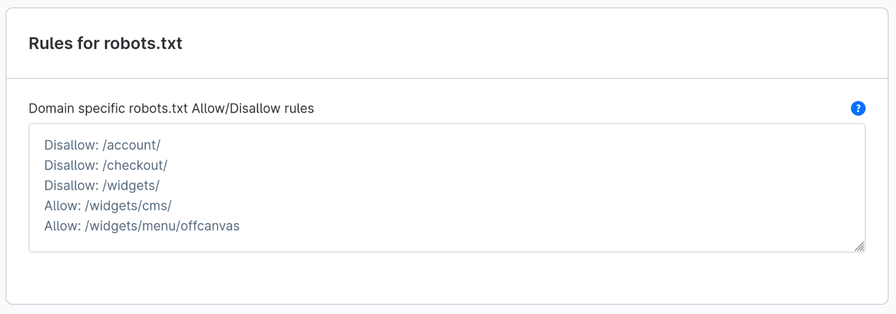

---
nav:
  title: v6.7.1.0
meta:
  date: "2025-07-24"
---
# Release notes Shopware 6.7.1.0

## Abstract

This minor release comes with some interesting improvements such as switch between metric and imperial measurement system. Additionally, at least 11 bugs have been fixed. Many thanks to 25+ contributors!

## System requirements

* tested on PHP 8.2, 8.3 and 8.4
* tested on MySQL 8 and MariaDB 11

## Improvements

### Switch between metric and imperial unit system per Sales Channel

With this new option, you can now configure which measurement units should be displayed per sales channel and domain. You can now maintain product values in your preferred unit, and Shopware will automatically convert them to the appropriate unit for the respective domain or sales channel.

### Theme configuration changes

* Theme configuration used during storefront rendering is now stored in a `theme_runtime_config` table and regenerated on the refresh stage of theme lifecycle.
* The `\Shopware\Storefront\Theme\CachedResolvedConfigLoader` is now deprecated and will be removed in the next major version. Please update the code that directly uses it to use the `\Shopware\Storefront\Theme\ResolvedConfigLoader` instead.
* The `\Shopware\Storefront\Theme\Exception\ThemeAssignmentException` is now deprecated and will be removed in the next major version. Please use `\Shopware\Storefront\Theme\Exception\ThemeException::themeAssignmentException`.

### Measurement system units info are now provided in the store-api

The store API now provides the measurement system units info in the response of the `context` endpoint and `product` API endpoints depending on the configured measurement system of the sales channel domain.

_Note: The product's measurement units are still stored in the database in fixed units (kg/mm) and converted to the configured measurement units of the sales channel domain when reading or writing the product's measurement units._

We added new request headers `sw-measurement-weight-unit` and `sw-measurement-length-unit` to allow clients to specify the measurement units for length and weight when reading or writing product's measurement units.

This is useful when the user can provide measurement units in the header and get the desired product's measurement units in the response. This also goes for writing the product's measurement units in the desired measurement units without convert the units back and forth.

### A generated robots.txt with adjustments from administration panel

This minor version comes with a generated robots.txt which can be adjusted and fine tuned from the admin panel. 



Learn the full story and how to use it: [https://www.shopware.com/en/news/hacktoberfest-2024-outcome-a-robots-txt-for-shopware/](https://www.shopware.com/en/news/hacktoberfest-2024-outcome-a-robots-txt-for-shopware/)


### New twig filter to convert measurement units

For the storefront, we added a new twig filter `sw_convert_unit` to convert measurement units in twig templates. This allows the developers to convert measurement units in the templates without writing custom logic.

It allows the developers to convert measurement units of any value, any variable in the templates without writing custom logic. 

Or they can also convert between any measurement units by passing the desired measurement unit as a parameter to the filter.

### Translation labels and helpTexts for Themes

A constructed snippet key was introduced in Shopware 6.7 and will be required starting 6.8. This affects `label` and `helpText` properties in the `theme.json`, which are used in the theme manager.

To provide translations for theme configuration, [creating administration snippets as usual](https://developer.shopware.com/resources/admin-extension-sdk/faq/#how-can-i-use-snippets-to-translate-my-app) will be mandatory.

The snippet keys to be used are constructed as follows. The mentioned `themeName` implies the `technicalName` property of the theme in kebab case. Also, please notice that unnamed tabs, blocks or sections will be accessible via `default`.

### ThemeConfiguration deprecations

* The `label` and `helpText` fields in the `/api/_action/theme/{themeId}/configuration` and in the 
`/api/_action/theme/{themeId}/structured-fields` API endpoints have been deprecated. For translations you should rely on
the `labelSnippetKey` and `helpTextSnippetKey` fields instead (present only in the structured fields endpoint).
* The `ThemeService::getThemeConfiguration` and `ThemeService::getThemeConfigurationStructuredFields` methods have been deprecated in favor of the new `ThemeConfigurationService::getPlainThemeConfiguration` and
`ThemeConfigurationService::getThemeConfigurationFieldStructure` methods. The new methods return the same data as the old ones, 
excluding the deprecated fields.

### Vue i18n Translation Functions

* The `$tc` function is deprecated and will be removed in v6.8.0
* Use `$t` function instead for all translations
* The `$tc` function now shows a deprecation warning when used with the feature flag `V6_8_0_0` enabled

### Primary delivery ordering and read-only cart extensions

The `OrderConverter` now explicitly moves the **primary order delivery** to the front of the deliveries list. This ensures legacy compatibility for existing usages of `$deliveries->first()`.
Two new cart extensions are introduced:
- `ORIGINAL_PRIMARY_ORDER_DELIVERY` – returns the originally determined primary order delivery.
- `ORIGINAL_PRIMARY_ORDER_TRANSACTION` – returns the originally determined primary order transaction.

These extensions serve as **informational only**: modifying them does **not** change the actual primary delivery or transaction set in the order.

### Custom field set name is now unique for apps

The `name` element of the `custom-field-set` in the app manifest is now unique per app. It should not be the case for your app anyway as it caused problems. However, you should check your app manifest and ensure that the `name` of the `custom-field-set` is unique.

### Deprecated configuration of visibility in config array

The visibility of filesystems should no longer be configured in the config array. Instead, it should be set on the same level as `type`. For example, instead of:

```yaml
filesystems:
  my_filesystem:
    type: local
    config:
      visibility: public
```

You should now use:

```yaml
filesystems:
  my_filesystem:
    type: local
    visibility: public
```

For more details, please see [UPGRADE-6.7.md](https://github.com/shopware/shopware/blob/6.7.1.0/UPGRADE-6.7.md#6710).

## Fixed bugs

* Translation for English (US) not working in Default Theme [#6601](https://github.com/shopware/shopware/issues/6601)
* SEO URLs are missing in footer navigation for landing pages [#3784](https://github.com/shopware/shopware/issues/3784)

See the entire list of fixed bugs:
* [https://github.com/shopware/shopware/milestone/8?closed=1](https://github.com/shopware/shopware/milestone/8?closed=1)

## Credits

* [Stefan Poensgen](https://github.com/stefanpoensgen)
* [Felix Schneider](https://github.com/schneider-felix)
* [Marvin](https://github.com/marvn-r3)
* [Oliver Skroblin](https://github.com/OliverSkroblin)
* [Max](https://github.com/aragon999)
* [Wanne Van Camp](https://github.com/wannevancamp)
* [thuong-le](https://github.com/thuong-le)
* [Benjamin Wittwer](https://github.com/gecolay)
* [Justus Geramb](https://github.com/jgeramb)
* [Elias Lackner](https://github.com/lacknere)
* [acris-lf](https://github.com/acris-lf)
* [Lukas Völler](https://github.com/LukasVoeller)
* [Marcus Müller](https://github.com/M-arcus)
* [jasperP98](https://github.com/jasperP98)
* [tinect](https://github.com/tinect)
* [Fayti1703](https://github.com/Fayti1703)
* [Sascha Heilmeier](https://github.com/Scarbous)
* [Lee Nguyen](https://github.com/nguyenquocdaile)
* [Vladislav Sultanov](https://github.com/TheBreaken)
* [Melvin Achterhuis](https://github.com/MelvinAchterhuis)
* [wbm-sbasler](https://github.com/wbm-sbasler)
* [Benedikt Schulze Baek](https://github.com/bschulzebaek)
* [Philip Standt](https://github.com/Ocarthon)
* [Stefan Reichelt](https://github.com/Songworks)
* [Hannes Wernery](https://github.com/hanneswernery)
* [Bjoern Herzke](https://github.com/wrongspot)

Thanks to all our contributors for helping us improve Shopware with every pull request!

## More resources

* [Detailed diff on Github](https://github.com/shopware/shopware/compare/v6.7.0.1...v6.7.1.0) to the former version
* [Changelog on GitHub](https://github.com/shopware/shopware/blob/v6.7.1.0/CHANGELOG.md) for this version.
* [Release News on corporate blog](https://www.shopware.com/en/news/shopware-6-release-news-july-2025/)
* [UPGRADE-6.7.md](https://github.com/shopware/shopware/blob/6.7.1.0/UPGRADE-6.7.md#6710)
* [Installation overview](https://developer.shopware.com/docs/guides/installation/)
* [Update from a previous installation](https://developer.shopware.com/docs/guides/installation/template.html#update-shopware)

## Get in touch

Discuss about decisions, bugs you might stumble upon, etc in our [community discord](https://discord.gg/ncfNP3xT). See you there ;)