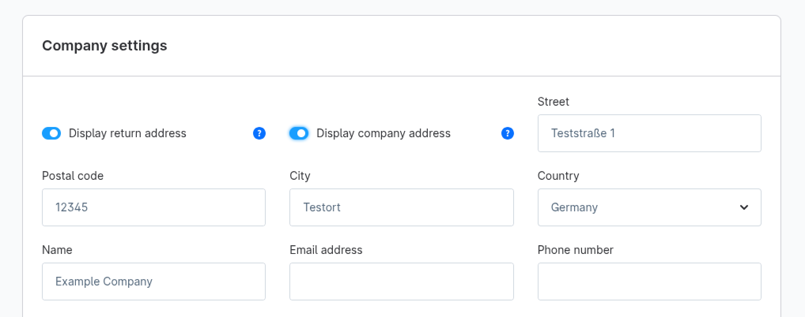
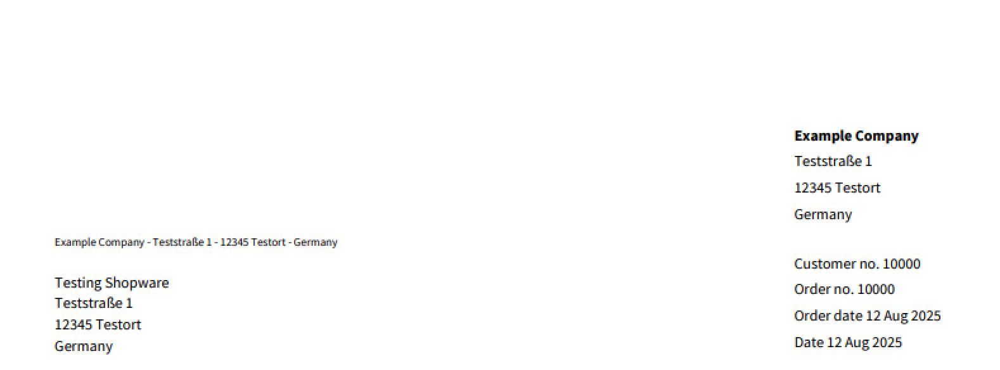
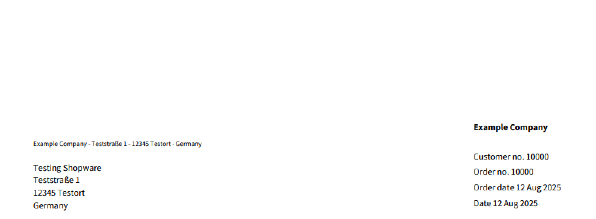

---
nav:
  title: v6.7.2.0
meta:
  date: ""
---

# Release notes Shopware 6.7.2.0

## Improvements

### Performance Improvements
Multiple performance bottlenecks were resolved, mainly addressing negative performance impact with growing data sets.

#### Optimized OpenSearch Querying for product listing
The way that sorting is handled when using OpenSearch was greatly improved in cases where translated fields where used for sorting, e.g. product names. 

Additionally, the queries were optimized to prevent nested queries, further improving performance.
Overall, this can improve the OpenSearch query time by up to 85%.

#### Dynamic category level loading
The category tree's loading was changed so that the active levels for the sidebar navigation are loaded dynamically to always show available child categories, independently of the `navigation depth` setting in the sales channel config.
This means that the `navigation depth` setting is now mainly responsible for the header navigation depth. 
In cases where that setting was increased to support deeper nesting levels in the sidebar navigation, it can be set to a lower value again, which will positively affect performance.

#### Optimized property group loading
The way in which the property groups for listing filters are loaded was improved. This mainly involved optimizing the SQL queries to avoid pagination (which gets slower with more data) and perform fewer joins.
Additionally, the sorting of the properties in the group was improved to use a more performant algorithm. 
This will improve the performance of loading the property filters by up to 50%, especially with a large number of property filters.

### Efficiency Improvements

#### Lower memory footprint on data imports
Memory usage, especially when importing a lot of custom fields, could be greatly reduced by reusing dynamic field definition objects and more efficient validator constraint caching.

Additionally, a memory leak in HTMLSanitize was fixed, which increased memory usage the more sanitized fields were written in a single request. 

This makes shopware more memory efficient, especially when writing bigger batches of data in a single request.

#### More efficient administration OpenSearch indexing
The indexing for the administration search indices on OpenSearch was improved to only reindex entities when search-relevant data was changed and not directly when any change happened to the entity.

### Return address in documents
The option `Display company` address in the `Company settings` section of the document configuration is now split into `Display return address` and `Display company address`.  

The former toggles the display of the return address above the customer address in the address block.  

The latter toggles the display of the company address below the header on the right-hand side of the document.

### More custom field set support in Apps

Apps can now also register custom field sets for the `Unit` and `Newsletter Recipient` entities.

## Fixed bugs
* [#11534](https://github.com/shopware/shopware/issues/11534) - Invoice document header missing (sender info) in Shopware 6.7.1
